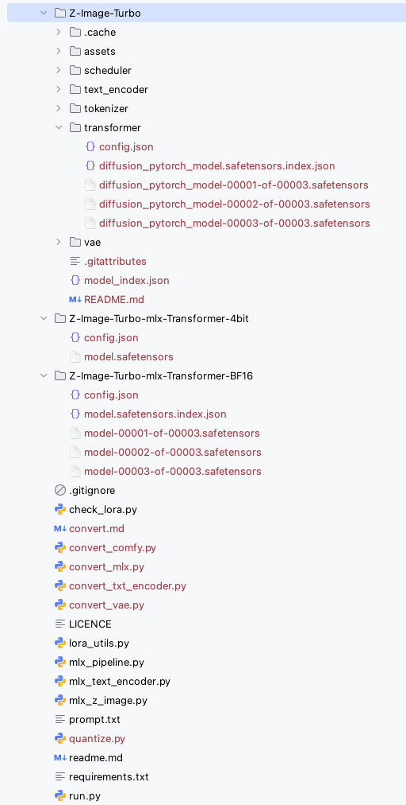

## Converting

| Files                                            | Target       | Input          | Output         |
|:-------------------------------------------------|:-------------|:---------------|:---------------|
| [convert_mlx.py](convert_mlx.py)                 | Transformer  | PyTorch (bf16) | MLX (bf16)     |
| [quantize.py](quantize.py)                       | Transformer  | MLX (bf16)     | MLX (4bit)     |
| [convert_txt_encoder.py](convert_txt_encoder.py) | Text_encoder | PyTorch (bf16) | MLX (4bit)     |
| [convert_vae.py](convert_vae.py)                 | VAE          | PyTorch (bf16) | MLX (Unstable) |

1. Using `conver_mlx.py`, convert original transformer weights (that sharded to 0001~0003), to MLX bf16
2. Using `quantize.py`, convert MLX bf16 to MLX 4bit
3. Using `convert_txt_encoder.py`, to convert text encoder to MLX
4. `convert_vae` is kinda working but there are several wierd artifacts that ruins image quality, so, I decide not to use,
    original pytorch version VAE is fast enough

5. this converting files should work on the same directory location on original weights and [mlx_z_image.py](mlx_z_image.py) file.

